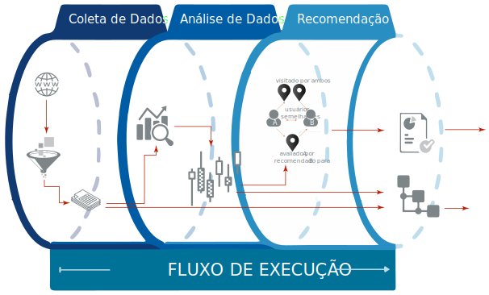

# Extração de Indicadores Estruturados e Não-Estruturados e sua Aplicação no Processo de Recomendação de Recursos Urbanos

<p align="justify">O principal objetivo desta pesquisa consiste em desenvolver uma abordagem capaz de analisar
os informações expressas em redes sociais baseadas em localização (LBSNs) no contexto de recomendação de recursos urbanos com o uso da KDT de modo a relacionar os aspectos referentes a polaridade das informações à confiabilidade dos perfis que as difundiram.
Para tanto, foram utilizadas abordagens de Web Mining no processo de descoberta de conhecimentos e análise de dados.
As features extraídas foram então aplicadas à algoritmos tradicionais de recomendação, baseados em vizinhança e em fatoração de matrizes, de modo a apurar métricas de acurácia com seu uso. </p>


#### Execução
<p align="justify"> Para a correta execução do código, devem ser instalas as bibliotecas auxiliares utilizadas no desenvolvimento. A instalação destas pode ser feita através do seguinte comando: </p>

```sh
$ pip3 install -r requirements.txt
```

Execução da aplicação via terminal:

```sh
$ python3 main.py
```

| Arquivo | Descrição |
| ------ | ------ |
| [main][mainfile] | arquivo principal onde realizam-se as chamadas aos demais métodos que compõe o *pipeline* de execução|
| [webscraping][webscrapingfile] | *script* desenvolvido de modo *ad-hoc* para coleta de dados provenientes da fonte utilizada (Foursquare)|
| [preprocess][preprocessfile] | *script* de pré-processamento dos dados |
| [process][processfile] | *script* de processamento dos dados a serem analisados |
| [analyser][analyserfile] | *script* desenvolvido para análise de dados do *dataset* de modo a extrair indicadores a serem utilizados no processo de recomendação |
| [recommendation][recommendationfile] | *script* onde são aplicados os algoritmos de recomendação utilizando a biblioteca [surprise][surpriselib] |
| [ontology][ontologyfile] | *script* de população automazida da [ontologia][onto] a partir do conjunto de dados atual|




[mainfile]: <https://github.com/brendasalenave/dissertacao/blob/master/main.py>
[webscrapingfile]: <https://github.com/brendasalenave/dissertacao/blob/master/webscraping.py>
[preprocessfile]: <https://github.com/brendasalenave/dissertacao/blob/master/preprocess.py>
[processfile]: <https://github.com/brendasalenave/dissertacao/blob/master/process.py>
[analyserfile]: <https://github.com/brendasalenave/dissertacao/blob/master/analyser.py>
[recommendationfile]: <https://github.com/brendasalenave/dissertacao/blob/master/recommendation.py>
[ontologyfile]: <https://github.com/brendasalenave/dissertacao/blob/master/ontology.py>
[onto]: <https://github.com/brendasalenave/dissertacao/tree/master/ontology>
[surpriselib]: <http://surpriselib.com>

<hr>

# Extraction os Structured and Non-Structured Indicators and their Application in the Urban Resources Recommendation Process

<p align="justify"> Source code developed for implementation of the practical part referring to the dissertation presented as a partial requirement to obtain a Master's degree in Computer Science. </p>	

 <p align="justify"> The main objective of this research is to develop an approach capable of analyzing information expressed in social networks based on location (LBSNs) in the context of the recommendation of urban resources with the use of KDT in order to relate the aspects related to the polarity of the information to the reliability of the profiles that disseminated them.	
In order to do so, we used "Web Mining" approaches in the process of knowledge discovery and data analysis.	
The features extracted were then applied to the traditional algorithms of recommendation, based on neighborhood and factoring matrices, in order to ascertain accuracy metrics with its use. </p>	

 #### Execution	
<p align="justify"> For the correct execution of the code, the auxiliary libraries used in the development must be installed. The installation of these can be done through the following command:  </p>	

 ```sh	
$ pip3 install -r requirements.txt	
```	

 Execution of the application via the terminal:	

 ```sh	
$ python3 main.py	
```

| File | Description |
| ------ | ------ |
| [main][mainfile] | the main file where the invocationcalls to the other methods that compose the execution pipeline are made|
| [webscraping][webscrapingfile] | script developed ad-hoc mode for collecting data from the used data source (Foursquare) |
| [preprocess][preprocessfile] | preprocessing data script |
| [process][processfile] |  script for processing the data to be analyzed |
| [analyser][analyserfile] | script developed for data analysis of dataset in order to extract indicators to be used in the recommendation process |
| [recommendation][recommendationfile] |  script where the recommendation algorithms are applied using the [surprise][surpriselib] library |
| [ontology][ontologyfile] | script for automated population of the [ontology][onto] from the current data set|

[mainfile]: <https://github.com/brendasalenave/dissertacao/blob/master/main.py>
[webscrapingfile]: <https://github.com/brendasalenave/dissertacao/blob/master/webscraping.py>
[preprocessfile]: <https://github.com/brendasalenave/dissertacao/blob/master/preprocess.py>
[processfile]: <https://github.com/brendasalenave/dissertacao/blob/master/process.py>
[analyserfile]: <https://github.com/brendasalenave/dissertacao/blob/master/analyser.py>
[recommendationfile]: <https://github.com/brendasalenave/dissertacao/blob/master/recommendation.py>
[ontologyfile]: <https://github.com/brendasalenave/dissertacao/blob/master/ontology.py>
[onto]: <https://github.com/brendasalenave/dissertacao/tree/master/ontology>
[surpriselib]: <http://surpriselib.com>
